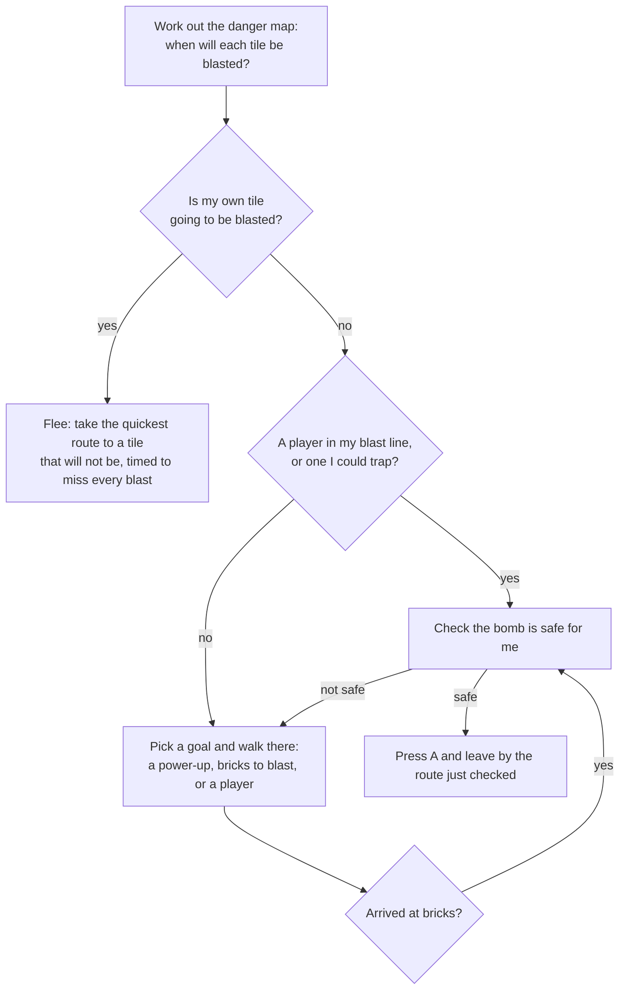

# CPU players

The three other bots in a round are played by the computer. This explains how they think, how the three levels differ, and what has been measured about them. The code is `src/bot.ts`.

- [What they are](#what-they-are)
- [How one thinks](#how-one-thinks)
- [How they avoid their own bombs](#how-they-avoid-their-own-bombs)
- [How they go after players](#how-they-go-after-players)
- [The shield and the curse](#the-shield-and-the-curse)
- [The falling blocks](#the-falling-blocks)
- [The three levels](#the-three-levels)
- [What has been measured](#what-has-been-measured)
- [What is not known yet](#what-is-not-known-yet)
- [Changing them](#changing-them)

## What they are

A CPU player is handed the world and gives back exactly what your controls give: a direction, and whether A and B are pressed, sixty times a second. It moves by the same rules as you, at the same speed, with the same bombs. It cannot see under bricks and has no powers a player lacks.

You choose the level in the menu, under **CPU players**: Beginner, Normal or Hard. Normal is the default. The choice is remembered on the device, and changing it in the middle of a paused round takes effect at once.

## How one thinks

```mermaid
flowchart TD
  A["Work out the danger map:<br>when will each tile be blasted?"] --> B{"Is my own tile<br>going to be blasted?"}
  B -- yes --> C["Flee: take the quickest route to a tile<br>that will not be, timed to miss every blast"]
  B -- no --> D{"A player in my blast line,<br>or one I could trap?"}
  D -- yes --> E["Check the bomb is safe for me"]
  D -- no --> F["Pick a goal and walk there:<br>a power-up, bricks to blast, or a player"]
  F --> G{"Arrived at bricks?"}
  G -- yes --> E
  E -- safe --> H["Press A and leave by the route just checked"]
  E -- not safe --> F
```

**The danger map** is the heart of it. For every tile it holds when a blast will be there and for how long. It is built from every bomb on the floor, and it follows the rules exactly: bricks stop a blast unless an earlier blast will have burnt them away, a bomb caught in a blast goes off early and sets off the next, a kicked bomb is followed to where it will stop, a thrown bomb to where it will land, and a bomb falling from a plane to where it will land (with the same sums as the rules: `dropLanding`).

**Walking** uses that map with timing. A route is only taken if every tile on it is clear while the bot is on it, with a little time to spare. That lets a bot run through a lane that will be blasted later, or wait out a blast and cross after it.

## How they avoid their own bombs

Before any level presses A, three things must all be true. If one fails, it does not drop the bomb.

1. **There is a way out.** With the new bomb added to the danger map, there must be a tile it can reach in time that will not be blasted.
2. **Nobody can shut that way out.** It looks at each player close by who has a bomb to drop. If that player could get onto the escape route before it does, or could cut the route by dropping a bomb where they stand, the route does not count and it tries another. Lower levels only watch players near them; Hard watches everyone.
3. **The move works when played forward.** It copies the whole world, presses A in the copy, walks the escape route with the real rules, and checks it is still alive when the bomb has gone off.

The first version only did steps 1 and 3. Alone, that was enough: no bot ever blasted itself. With four bots in the arena, about one in five went out to its own bomb. Replaying those matches showed the same thing every time: the escape route was fine when the bomb was dropped, and then another player dropped a bomb on it. Step 2 was added for that.

A bot can still be caught by its own bomb when another player traps it after the bomb is down. That is the other player's doing, and it is a tactic Hard uses on purpose.

When a bot is boxed in with no route out, Normal and Hard will kick a bomb out of the way if they have the boot, and Hard will lift one and throw it clear if it has the glove. Each of these is also played forward on a copy first.

## How they go after players

- **Bombing a player in line.** If a player is in its blast line and close enough, it drops a bomb (after the safety checks). How close, and how often it takes the chance, depends on the level.
- **Hunting.** Spots it could bomb a player from are goals, alongside power-ups and bricks. Higher levels weigh them more, so they come looking for you sooner.
- **Traps (Hard).** It works out whether one bomb would leave a player no way out at all, always takes that shot, and looks for nearby spots where it would be true.
- **Bombs that work together (Hard, `combos`).** Running from a blast, it checks each tile it crosses: would a bomb dropped here leave a player no way out? Often it would, because the blast it is running from sets the new bomb off early, chained, long before its own fuse. And when a player is already in a blast's way, it looks for the bomb that closes that player's last way out (on the way out, or covering where it leads), not only bombs that reach the player.
- **Kicking bombs at players (Hard).** With the boot, a bomb lying next to it with a player further down the lane gets kicked at them, also on the run, and the spot behind such a bomb is a goal worth walking to while there is time. A player down an open lane beyond its blast's reach gets a bomb dropped, stepped back from and kicked down the lane at them (`dropKick`).
- **Throwing bombs at players (Hard, `throwAttack`).** With the glove, it drops a bomb, lifts it and throws it three tiles, over blocks and bricks: where the throw would leave a player no way out, or onto a player a bomb where it stands would not reach.
- **Hunting before shopping (Hard, `kitSense`, `tunnel`).** A power-up it already has plenty of is worth little, one it cannot use any more nothing; the boot, the glove and the laptop are worth more than another bomb. A spot to blast bricks from counts for more the nearer it is to a player, counting the way through bricks, so it bores a way through to you.
- **Not being trapped (Hard).** If a nearby player could box it in with one bomb, it moves somewhere that is not true before doing anything else.

## The shield and the curse

- **Every level wants a shield** and will walk to one, about as keenly as to any other power-up.
- **Holding a shield changes nothing about how careful they are.** They dodge blasts and check their bombs exactly as before. The shield is there for the blast they did not see coming. When a move is played forward on a copy of the world, a move that only works because the shield takes a blast counts as failing (`playOut`, since 25 November 2026: before that it counted as survived, and on the Wild West a Hard kicked and bombed itself into a corner that only its shield made look safe; the shield took the first blast and the second outlasted the half second).
- **Once a shield has taken a blast**, they know blasts do no harm for the next half second and use it to walk out through the flames. Before that was added, a bot stood still in a chain reaction and was caught by the second bomb.
- **No level goes looking for a curse.** Normal and Hard also treat one lying on the floor as something to walk round, when there is another way. If the only way to anything worth doing is through it, or the only way out of a blast, they go through. Beginner does not look.
- Hard does not count a curse as a power-up worth sparing when it blasts bricks.

## The falling blocks

When the timer reaches 0:00 blocks fall round the edge and inward for 50 seconds (see [GAME-RULES.md](GAME-RULES.md)). The order is fixed and the same every round, so a person can learn it, and the CPU players know it.

- **A tile a block will land on is treated like a blast that never ends.** It goes into the danger map from just before the block lands. Each level looks a different distance ahead (`blockSight`): Beginner only as far as the blocks it can see falling, Hard eight seconds.
- **A block about to land sends it running**, as a blast does (within about a second and a half).
- **A block further off is a reason to move on, not to run.** It heads for the nearest tile that will last longer, but it can still stop to bomb a player on the way. That keeps them fighting while the arena closes.
- **A blast comes before a block.** Getting clear of a bomb, a tile only has to outlast the blast, even if a block is due on it a few seconds later.
- **The rectangle in the middle is never covered** (`keptSize`: 9 by 7 on Standard, 7 by 5 on Mini and Big since 20 November 2026; a 7 by 5 everywhere from 18 November, a 5 by 5 square before; "the square" below means this area), so there is always somewhere that counts as safe, and they end up in it.
- Hard will step out to bomb a spot that shuts other players into a dead end of the closing arena, if it can still get clear itself.

Beginner has one weakness left in on purpose. Because it only steps aside from the block that is falling, it can back itself into a corner that the ring then closes.

## On the Wild West: trains and TNT

The Wild West's railway and TNT (25 November 2026; docs/GAME-RULES.md › The Wild West's railway and TNT) go into the same danger map:

- **A train** is a blast along its line, each tile from just before the train gets there until just after it has gone, a little wider at both ends for a robot walking across. They know of it once its warning starts, as a person does: Hard and Normal at once, give or take their `notice`, a slow level up to two thirds of a second later (`TRAIN_NOTICE`). Never before, not even in a try-out on a copy of the world (`seenCopy` leaves a train whose warning has not started in its tunnel). A robot on its line when the warning starts runs off it like a robot on a bomb's line. They know it sets off a bomb on its line the moment it reaches it, and smashes the bricks on it (since the same evening, when bricks were let onto the lines).
- **A barrel of TNT** is a block they walk round. A blast that will reach one (their own bomb's, or anyone's) lights it in the danger map, and the barrel's blast is added: every way until a wall, a solid block or a brick, setting off the bombs and barrels it reaches. A bomb's worth, when they choose where to drop one, does not count what a barrel would do (they do not set barrels off on purpose), but the safety checks do.
- The first try had a robot touched by the train within 0.7 of a tile of its line: Beginners resting at the edge of a tile beside a line were run over by the dozen (19 of 48 in twelve rounds), since they counted as standing beside it. The rule is now the same as for a blast: the tile a robot counts as standing on.

## Pressing in the square

Careful players in the open area (a 5 by 5 square when this was written, 7 by 5 since) can circle each other for minutes. So once the timer has run out and a Normal or Hard CPU player is standing in the square, it presses (`squareBold` in `LEVELS`, `emboldened` and `inSquare` in `src/bot.ts`). While it is there:

- it bombs any player in line, every chance it gets, from any distance;
- it uses every bomb it holds;
- it is pulled toward players much harder, and does not pause before setting off;
- it drops bombs beside players as well as in line with them, to take away the room they have to stand in (within `SQUEEZE_REACH`, 4 steps);
- it stops holding back in case a rival shuts its way out (`guard` is switched off).

What does not change: it still needs a way out before it presses A, and it still plays the move forward on a copy of the world first. So it does not walk into its own blast, but it can now be shut in by a rival's bomb, which is the risk that ends rounds.

It applies only while the bot itself is inside the square after 0:00. A bot still on its way in plays as it did. Beginner never presses.

## As zombies

Out of lives with Zombie picked, a CPU player is a zombie in the arena, with one 1-tile bomb and half the starting speed. It plays as usual with that (the same safety rules for its bombs), goes after the robots still in the round and not other zombies, and leaves power-ups alone (`itemWorth` is 0). In 15 rounds of four Normal CPU players, the zombies dropped 75 bombs between them; they rarely catch anyone, which is what a 1-tile blast at that speed gives.

## With a laptop

The laptop (see [GAME-RULES.md](GAME-RULES.md), Laptop) is worth about as much to them as a boot or a glove they have not got, so they go for one (`itemWorth`).

**Taking off.** Holding a laptop, not carrying a bomb, with nothing heading for its tile and no rival within 3 tiles (one who could walk up while its robot stands still), a CPU player flies, each time it thinks, at its level's chance (`fly`: Beginner 15%, Normal 45%, Hard 90%).

**Flying** (`pilot`). It goes for the rival nearest the plane and steers straight for where it reckons that rival will be when a bomb lands: as far ahead as the rival will have walked by then, times its level's `lead` (Beginner aims where the rival is), give or take `slop` tiles each way. It lets a bomb go when it judges, by eye, that the bomb would land right there, its feel for how far a falling bomb carries on off by up to `carry` of the real distance either way. Both errors are picked once a flight (and again if it changes target), as a person misjudging would be: a flight that misjudges keeps missing. It never lets a bomb go that the rules' own sums say would reach its own robot or a teammate, or set off something that would (the danger map with the bomb added must be no worse on its own tile). If a blast heads for its robot it lands the plane at once and runs.

**Seeing other players' falling bombs.** Another player's falling bomb is noticed as soon, for the 0.8 s it falls, as a bomb on the floor is for its 2.55 s fuse (`notice`): Beginner after 22 ticks of the 48, Normal after 7, Hard at once. So a Beginner sees one coming only late, and a Hard one in time to step aside.

**How often a flight gets someone** (`experiments/pilot.ts`, 60 arenas each, 24 November 2026, with one bomb, 6 s flights, taking off towards the middle, 3.3 tiles and about 122° a second; the share of flights that knocked the target out):

| Pilot | A robot that never looks up and walks to the next wall (no bricks) | One that also turns at random every half second (no bricks) | A Normal CPU player, which dodges what it notices (some bricks) |
|---|---|---|---|
| Beginner | 22% | 25% | 6% |
| Normal | 35% | 28% | 8% |
| Hard | 80% | 23% | 12% |

(At 3 tiles and 93.75° a second, 23 November 2026: Beginner 12%, 21%, 5%; Normal 33%, 33%, 5%; Hard 72%, 20%, 8%. With three bombs and 16 s flights, 19 November 2026: Beginner 41%, 39%, 6%; Normal 67%, 58%, 17%; Hard 93%, 48%, 25%. With the first plane, 4.8 tiles a second for 8 s: Beginner 46%, 30%, 16%; Normal 62%, 50%, 22%; Hard 83%, 58%, 24%. Their settings were left as they were.)

Against someone who keeps an eye on the sky, a flight mostly misses; against someone who never looks up, a Hard pilot hardly ever does. With one bomb a flight (since 23 November 2026) a miss is a wasted laptop, so the numbers fell to about a third of what three bombs got; against someone who dodges, a flight now rarely lands. A CPU pilot also no longer lets go when it judges the bomb would land on the outer wall beside its target (it used to count that as on target). How it feels to be bombed by one, and whether Hard is too good at it, has to be played: the four numbers in each level's line are the ones to turn.

## As angels

Out of lives with Angels on, a CPU player is an angel on the wall (`angelInput` in bot.ts). It picks the robot nearest to it, goes round the wall to the closest place in line with that robot that a throw can reach (2 to 6 tiles in: over its column from the top or bottom, or by its row from a side), holds A for exactly that distance and lets go. It aims where the robot is, not where it is going. Between throws it rests, by level (`ANGEL_REST`): Beginner 150 ticks, Normal 70, Hard 25. Its own robot's knockout makes it forget its plan, so a robot coming back after a lost life starts thinking afresh.

## The three levels

All of these are in the `LEVELS` table at the top of `src/bot.ts`. Times are in ticks: 60 ticks are one second.

| | Beginner | Normal | Hard |
|---|---|---|---|
| Thinks every (`think`) | 30 ticks | 16 | 4 |
| Pause before setting off (`hesitate`) | 40 to 110 ticks | 6 to 26 | none |
| Notices another player's bomb after (`notice`) | 70 ticks | 22 | at once |
| Time kept spare when dodging (`margin`) | 14 ticks | 9 | 4 |
| Bombs out at once (`maxBombs`) | 1 | 2 | all it has |
| Pull toward players (`hunt`) | 0.12 | 0.55 | 4 (1.6 until 23 November 2026) |
| Bombs a player in line (`attack`) | 20% of chances | 50% | always |
| From how far (`attackReach`) | 2 tiles | 4 | 8 |
| Sets traps (`killShot`) | no | no | yes |
| Watches for players who could shut it in (`guard`) | within 3 tiles | 5 | whole arena |
| Kicks a bomb to escape (`kickEscape`) | no | yes | yes |
| Kicks bombs at players (`kickAttack`) | no | no | yes |
| Throws bombs at players (`throwAttack`) | no | no | yes |
| Bombs on the run and two-bomb traps (`combos`) | no | no | yes |
| Knows what it has enough of (`kitSense`) | no | no | yes |
| Bores through bricks towards players (`tunnel`) | no | no | up to 3 times the worth |
| Throws a bomb to escape (`throwEscape`) | no | no | yes |
| Moves out of spots it could be trapped in (`evade`) | no | no | yes |
| Leaves power-ups unburnt (`spareItems`) | no | no | yes |
| Walks round a curse (`dodgeCurse`) | no | yes | yes |
| Knows where blocks will fall (`blockSight`) | 0.9 s ahead | 2.5 s | 8 s |
| Presses in the square after 0:00 (`squareBold`) | no | yes | yes |
| Randomness in choosing goals (`wobble`) | 0.6 | 0.3 | 0.05 |
| Flies a laptop's plane when it can (`fly`) | 15% of chances | 45% | 90% |
| Aims ahead of a moving rival (`lead`) | not at all | 40% of the way | all the way |
| Aim off by up to (`slop`), once a flight | 3 tiles each way | 2 | 0.8 |
| Misjudges how far a falling bomb carries (`carry`), once a flight | by up to 90% | 85% | 60% |

In short:

- **Beginner** is slow to react, carries one bomb, and mostly digs for power-ups. It will sometimes bomb you if you stand next to it, and it will blunder over a curse lying in its way.
- **Normal** collects power-ups and comes after you once it can reach you.
- **Hard** reacts at once, comes for you from the start, sets traps with several bombs at once, kicks and throws bombs at you, flies the laptop's plane, and will not let itself be cornered.

Hard was made more aggressive on 23 November 2026, after the owner watched a Hard CPU player fail to knock out a Beginner one: one against one it won 23 of 40 rounds, 7 of them before the timer ran out, and 17 were still going 2 minutes after the blocks stopped; it never kicked or threw. With `hunt` 4, `kitSense`, `tunnel`, `combos`, `throwAttack` and the kicks above it won 59 of 60, 48 before the timer ran out (the one-against-one table below). Beginner and Normal were not changed.

There were four levels at first. On 11 November 2026 they were cut to three after play-testing: what was called Extreme is now Hard, the old Hard (which sat between the two) was dropped, and Normal was eased a little (it thinks every 16 ticks instead of 14, pauses 6 to 26 ticks before setting off instead of 0 to 14, notices bombs after 22 ticks instead of 16, `hunt` 0.55 from 0.7, `attack` 50% from 60%). Beginner was not changed. A phone that had Extreme saved now gets Hard.

No level cheats, and no level is made easier by being careless with its own bombs. The easy levels are easy because they are slow and unambitious.

## What has been measured

`experiments/cpu-matches.ts` plays whole rounds with no screen and counts how each bot went out. These are the real CPU players under the real rules: three levels, a blast that starts one tile long, the timer, the falling blocks that start when it reaches 0:00, the square they leave open, and Normal and Hard pressing once they are in it. Recorded again on 18 November 2026, after the area the blocks leave open was made 7 by 5 (it was a 5 by 5 square) and the fuse made 2.55 s (it was 2.5); the first recording was on 11 November 2026, after the timer was shortened to 1 minute 30 and the blocks made 20% faster. Where the 18 November figures differ much from the 11 November ones, the notes say so.

A round has no end of its own: the timer runs 1 minute 30, the blocks take 50 seconds to fall, and then it goes on in the square until someone wins. These runs give up 2 minutes after the blocks stop (4 minutes 20 in) and count the round as **not decided**.

**Four of the same level** (60 rounds, so 240 bots per level):

| Level | Blasted itself | Shut in by a rival | Caught in a rival's blast | Under a block, early | Under a block, in the last 15 s of them | Won | Rounds drawn | Not decided | Decided after |
|---|---|---|---|---|---|---|---|---|---|
| Beginner | 0.0% | 0.4% | 42.9% | 0.8% | 0.8% | 1.7% | 0 of 60 | 56 of 60 | 91 s |
| Normal | 0.0% | 27.9% | 42.1% | 1.3% | 3.3% | 23.8% | 1 of 60 | 2 of 60 | 154 s |
| Hard | 0.0% | 27.5% | 45.0% | 0.4% | 0.4% | 22.5% | 1 of 60 | 5 of 60 | 144 s |

(25 November 2026, the evening, after try-outs stopped counting on the shield and a thrown bomb's landing counts one landing ahead of it: the Beginner and Normal rows came out the same as the day before to the last figure, and Hard within noise; it was 25.0%, 47.9%, 22.9% won, 5 of 60.)

- "Shut in by a rival" and "blasted itself" are both a bot caught by its own blast. The script calls it "shut in by a rival" when, within six steps of where the bot stood, there was a tile its own bombs would not have reached that was blocked or about to be blasted by a bomb a rival dropped *after* the bomb that caught it. It looks at the arena as it was when that bomb was dropped, so a tile a block has landed on since still counts as a way out it had. A rival's bomb dropped on the very same tick counts too, and so does one a rival threw or kicked that came to rest on the way out afterwards, a rival's bomb let go from a plane (from the moment it was let go), and a rival's bomb a falling block took away after the bot dropped its own. It is also "shut in by a rival" when the bot's own bomb went off early because a rival's bomb (one from a plane too) set it off, and that rival's bomb was dropped, kicked, thrown or let go after the bot dropped its own, including when the bot's shield took a first blast and its own bomb's blast caught it half a second later. Anything else is "blasted itself".
- With the laptop in every arena (18 November 2026) the columns moved little: the CPU players fly it now and then, and a plane's bombs add to what catches them. The slower plane with 16 s flights (19 November 2026) moved them little again, and so did power-ups at 60% of bricks rather than 61.25% (the same day), and bricks on 80% of the open floor rather than 78% (the same day: the table above; the arenas differ each time).
- Before Normal and Hard pressed in the square, Normal left 32 of 60 rounds not decided and Hard 9. Now it is none and 2. The price shows in "shut in by a rival": Normal went from 3.8% to about 20%, Hard from 27.5% to about 34%. That is the risk they now take on purpose. Beginner does not press, and its 20 of 60 is the old figure give or take (it was 15).
- "Decided after" is the average length of the rounds that were decided. The blocks stop at 140 s, so most are settled in the square.
- With the shorter timer and faster blocks, rounds are settled about 35 seconds sooner than before, and the other columns moved little. One thing did move: four Hards drew 9 rounds of 60 (it was 2). Why was not looked into; with the 7 by 5 it is back to 2.
- With the plane faster and turning tighter (24 November 2026, the table above): every column within noise of the day before; blasted itself still 0 everywhere.
- With Hard made more aggressive (23 November 2026): four Hards settle their rounds about a minute sooner (122 s, was 176 s), only 7 of 60 still going 2 minutes after the blocks stop (20), and more of them go out to a rival's blast. The Beginner and Normal rows are the run before; they were not changed.
- With the plane's one bomb and 6 s, and the blocks 20% faster (23 November 2026): every column within noise of 20 November; blasted itself still 0 everywhere.
- With the 9 by 7 on Standard (20 November 2026): far more rounds still going 2 minutes after the blocks stop, Beginner 54 of 60 (10 before), Hard 21 (4), Normal still 1. The square has 51 tiles to stand on rather than 23, so careful players have room to keep out of each other's way; Beginner does not press in the square at all. Watch for rounds dragging on in play; the CPU players' pressing in the square (`squareBold`) is what would be tuned, if it shows with people too.
- With the 7 by 5 and the 2.55 s fuse (18 November 2026): about where it was. Four Beginners left 12 of 60 not decided with the 7 by 5 alone and 17 with the longer fuse too (20 before either): noise, mostly. Four Hards draw 2 of 60 again.

**One of each level in the same round** (three players, 180 rounds, each level in each of three corners equally often):

| Level | Won | Blasted | Under a block, early | Blasted itself | Rivals it blasted |
|---|---|---|---|---|---|
| Beginner | 0.0% | 93.3% | 0.6% | 0.0% | 1 |
| Normal | 16.1% | 80.0% | 0.6% | 0.0% | 27 |
| Hard | 75.0% | 19.4% | 0.0% | 0.0% | 256 |

3 of 180 drawn, 13 left undecided (25 November 2026, the evening, as above: within noise of the day before, 73.9% for Hard; 24 November 2026, the plane faster and turning tighter: Hard 77.2% the day before; 23 November 2026, Hard made more aggressive: it wins 77% of these rounds, was 39%; the run before gave 8 drawn, 39 undecided; 20 November 2026, the 9 by 7 on Standard: the bigger square leaves many more rounds going; with the 7 by 5 the same morning's arenas gave 6 drawn, 6 undecided; 19 November 2026, bricks at 80%: Normal won 35.6% and Hard 60.6% with bricks at 78% the same day, nothing in the CPU players changed between the two: a different set of arenas swings this table that much; with power-ups at 60%: 1 drawn, 3 undecided; with the slower plane just before: 3 and 4; with the first plane: 7 and 3; before the laptop: 4 and 5; with the 5 by 5 and the 2.5 s fuse: 5 drawn, 2 undecided) (it was 27 before they pressed in the square). The levels are well apart: each wins far more and blasts far more rivals than the one below.

**One against one** (`cpu-matches.ts duel`, 60 rounds each, the two taking each corner in turn, the whole round with the timer and the falling blocks; the last columns are what the first-named player did with its kit, a round on average):

| Pairing | Won | Lost | Won by a blast | Before 0:00 | Time to win | Drawn | Not decided | Blasted itself | Bombs | Most out at once | Kicks | Throws | Flights |
|---|---|---|---|---|---|---|---|---|---|---|---|---|---|
| Hard v Beginner | 59 | 1 | 59 | 52 | 65 s | 0 | 0 | 0 | 39 | 5.4 | 0.5 | 9.9 | 0.5 |
| Hard v Normal | 45 | 11 | 38 | 21 | 92 s | 4 | 0 | 0 | 65 | 5.1 | 2.1 | 29.9 | 0.5 |
| Hard v Hard | 33 | 26 | 24 | 9 | 101 s | 1 | 0 | 0 | 57 | 4.8 | 2.1 | 26.6 | 0.4 |
| Normal v Beginner | 42 | 4 | 39 | 9 | 129 s | 0 | 14 | 0 | 64 | 3.2 | 0.1 | 0 | 0.7 |

(25 November 2026, the evening, as above; within noise of 24 November, when the plane was made faster and turning tighter: Hard v Normal 49 won, 10 lost; Hard v Hard 33 and 25.)

Before Hard was made more aggressive (23 November 2026, 40 rounds each): Hard v Beginner won 23 of 40, 7 before 0:00, in 125 s on average, 17 still going 2 minutes after the blocks stopped, and it never kicked or threw; Hard v Normal won 23 and lost 11. A kick is rarer than a throw: it needs the boot and a lane, the glove only a rival three tiles off.

**Three of one level against a slow, careless player** (a Beginner CPU player standing in for a person, 80 rounds):

| Three of | Blasted the player | Average time | A block got the player | The player won | Not decided | CPU players that blasted themselves |
|---|---|---|---|---|---|---|
| Beginner | 34 of 80 | 119 s | 1 of 80 | 2 of 80 | 75 of 80 | 0 |
| Normal | 62 of 80 | 115 s | 5 of 80 | 2 of 80 | 12 of 80 | 0 |
| Hard | 80 of 80 | 50 s | 0 of 80 | 0 of 80 | 4 of 80 | 0 |

(25 November 2026, the evening; the day before, with the plane faster and turning tighter, 45 s and 3 of 80 not decided for Hard.)

(23 November 2026, Hard made more aggressive: three Hards got the player every time, in 50 s on average; they took 100 s and missed 15 of 80 before.)

(20 November 2026, the 9 by 7 on Standard. With the 7 by 5: Beginner 51 got the player, 14 not decided; Normal 51 and 0; Hard 68 and 7, and 1 under "blasted themselves" before the script saw thrown bombs in the air, replayed: a rival's doing, see below.)

This table is noisy, and the stand-in is not a person. Read it loosely.

**Alone until 10 seconds after the blocks stop, in an arena of bricks** (40 arenas). Does it get into the square before the blocks stop?

| Level | Blasted itself | Caught by a block | In the square at the end |
|---|---|---|---|
| Beginner | 0 of 40 | 1 of 40 | 39 of 40 |
| Normal | 0 of 40 | 0 of 40 | 40 of 40 |
| Hard | 0 of 40 | 0 of 40 | 40 of 40 |

(20 November 2026, the 9 by 7 on Standard: no Beginner caught, as the third ring no longer falls; 19 November 2026, bricks at 80%: Beginner 3; with bricks at 78% and power-ups at 60%, Beginner 2; with the laptop the day before, Beginner 1; before the laptop: Beginner 4, Normal 1, Hard 1 caught. The arenas differ each time the chances move.) The Normal and Hard caught in the run before the laptop (with the 2.55 s fuse; 0 of 40 just before it) were replayed: each was standing still on a tile of the edge rings, shut in a pocket of bricks with no safe way to bomb out (the known gap, below), when a block landed on it. Over 120 arenas the old and new fuse give the same: Normal and Hard 1 of 120 each, Beginner 5 and 7 of 120. The 40 arenas here simply took in those cases this time.

**Alone with a player who stands still, no timer** (40 arenas, 3 minutes each). This one is run without the timer, because otherwise the blocks would get the still player and it would look like a win:

| Level | Blasted itself | Got the other player | Average time |
|---|---|---|---|
| Beginner | 0 of 40 | 25 of 40 | 125 s |
| Normal | 0 of 40 | 39 of 40 | 96 s |
| Hard | 0 of 40 | 40 of 40 | 54 s (76 s before 23 November 2026) |

Most of that time is spent digging through bricks from one corner to the other. With the laptop (19 November 2026, the slower plane and power-ups at 60%; before the laptop: 12 of 40 in 156 s, 133 s, 113 s) it is quicker: a CPU player that finds the laptop can fly over the bricks to a player who stands still. It takes longer than it did, because a blast now starts one tile long. Beginner's figures moved since the last run (11 of 40, then 17) although Beginner was not changed: the arenas are different, because the power-up chances have changed (this run has no timer, so the 7 by 5 plays no part in it).

**On the Wild West** (25 November 2026, the evening, `WEST=1` in front of each run: the railway with bricks on it, a train every 8 to 12 s and the TNT in every arena, Standard size, otherwise as above):

| Run | Blasted itself | What else |
|---|---|---|
| Four of the same level | 0 for every level | Beginner 41.7% caught in a rival's blast, 50 of 60 not decided; Normal 32.5% shut in by a rival, 38.8% caught; Hard 18.3% and 54.2%, 3 of 60 not decided |
| One of each level | 0 for every level | Hard won 81.7%, Normal 14.4%, Beginner 0.6%; none drawn, 6 of 180 undecided. 8 robots hit by a train over these two runs |
| Against the stand-in | 0 | Three Hards got it 80 of 80 times, in 47 s; Normals 62, Beginners 31. 1 robot hit by a train |
| Alone among bricks | 0 | All three levels in the square at the end, 40 of 40 |
| Alone with a still player | 0 | Got it: Beginner 33, Normal 39, Hard 40 of 40, in 84, 57 and 32 s. 1 robot hit by a train |
| One against one | 0 | Hard beat Beginner 58 to 2, Normal 53 to 7, Hard v Hard 35 to 23; Normal beat Beginner 39 to 4. 8 robots hit by a train |

A train hits a CPU player now and then: 18 robots in all of these runs together, a few hundred rounds (not replayed to see why).

### What the replays have caught

The "blasted itself" column is only worth anything because every case that lands in it is replayed. So far:

- **The first version** checked only that a bomb left a way out. With four bots in the arena about one in five went out to its own bomb, each time because a rival then bombed the way out. That is what `guard` was added for.
- **The narrow test.** The first test for "shut in by a rival" (a rival's bomb on or next to the bot's tile) left four cases under "blasted itself". All four were a rival's later bomb, further off. The test was widened.
- **The shield.** One Hard bot stood still in a chain reaction after its shield took the first blast, and the second bomb's blast outlasted the half second of safety. They now walk out.
- **The falling blocks.** One bot of the top level dropped a bomb with a way out, then refused to use it: a block was due on the safe tile five seconds later, and it counted that as no better than the blast. It stood in its own blast. A blast now comes first. One Hard bot in the last seven seconds was caught between its own bomb, a rival's bombs and a block that had just landed on its way out; the test now sees the arena as it was when the bomb was dropped.
- **Pressing in the square.** The first run with it put three bots under "blasted itself". Replayed, all three were a rival's doing: a rival dropped a bomb on the way out on the same tick the bot dropped its own, or threw one that landed on the way out afterwards. The test only counted bombs dropped later, on the tile they were dropped on. It now counts those cases too.
- **Set off early.** The first run with the shorter timer put two Normal bots under "blasted itself" in the run against the stand-in. Replayed, both were the same thing: the bot dropped a bomb with a way out and was walking it; a rival then kicked a bomb of its own into a blast that was still burning, which set that bomb off two seconds early; its blast reached the bot's bomb and set that off too, with the bot still in line. Nothing on the board when it pressed A said that would happen. The test now counts a bot's bomb set off early by a rival's bomb that was dropped, kicked or thrown afterwards.
- **Beginner was made easier on 10 November 2026** after play-testing found it still hard: it pauses longer before setting off (40 to 110 ticks, was 20 to 60), notices other players' bombs later (70 ticks, was 45), is drawn to players less (`hunt` 0.12, was 0.3) and bombs a player beside it less often (20% of chances, was 40%).

- **The 7 by 5 (18 November 2026).** The run against the stand-in put one Hard bot under "blasted itself" (seed 21, the stand-in in seat 1, player 3, 140 s in, as the blocks stopped). Replayed, it was a rival's doing that the script cannot see: a rival Hard with the glove lifted two of its bombs, one after the other, and threw them; they were still in the air when it dropped its next bomb, and they came down either side of it in the 7 by 5. When its last bomb went off, their flames were still burning across both of its ways out. The script misses it because the bombs that shut it in were its own (only thrown by the rival) and had already gone off, leaving flames, when it went out. Not a fault of the bot's own: left as it is, with this note.
- **Beginner alone among bricks (tests/bot.test.ts, 18 November 2026).** With the 7 by 5, the alone test's Beginner in the brick arena ran from its own bomb onto the third ring as it closed and a block landed on it. That is its short sight for blocks (under a second) by design; the test now allows a block, never its own blast, for Beginner only. The `alone` run's figures are unchanged (1 of 40 caught by a block).

- **The square fight test (tests/bot.test.ts, 18 November 2026).** With the 2.55 s fuse, the one arena where two Normals had to settle the fight in the square within 90 s stalled instead (it took 27 s with the 2.5 s fuse). Over 40 arenas the share settled within 90 s was the same with either fuse (22 and 21 of 40; 22 with the old 5 by 5 too): two Normals in the open area settle about half their fights within 90 s, and a few never. The test now plays 24 arenas and asks for at least 8 (Normal) and 18 (Hard) of them.

- **The laptop (18 November 2026).** The first run with it put three bots under "blasted itself" (four Normals, seed 4, player 1; one of each level, seed 54, the Hard in seat 0, and seed 197, the Normal in seat 2). Replayed, all three were a rival's doing that the script could not see. Seed 54: a rival's bomb let go from a plane, after the Hard had dropped its own, was coming down on its way out; it stood still, shut in, and its own blast caught it a moment before the plane's bomb landed. Seed 197: a rival's plane bomb landed right on the Normal's own bomb with the Normal standing on it; its shield took that blast, and its own bomb, set off by the plane's, burned on past the half second of safety. Seed 4 (late in the falling blocks): a rival dropped a bomb whose blast covered both its ways out, then a falling block took that bomb away; by then the blocks were coming up the same column. The script now counts a rival's bomb from a plane like one dropped when it was let go, a rival's bomb a block took away like one still there, and its own bomb set off early by a rival even when the bot's shield made it go out a moment later. All three now read "shut in by a rival", and the column is back at zero.

- **Kicked away and back (23 November 2026, Hard made more aggressive).** The run with one of each level put one Hard under "blasted itself" (seed 468, Beginner, Normal, Hard, the Hard 21 s in). Replayed: the Hard dropped a bomb and kicked it down a column at the Normal, then dropped another to break a brick, its way out down that column. The Normal, boxed in by the bomb that had stopped in front of it, kicked it back up the column (`kickEscape`), and it stopped on the very tile it was first dropped on, in the Hard's way out. The script took a bomb lying where it was dropped as never moved; it now counts a bomb a rival has kicked or thrown since it was dropped as moved (`rivalMoved`), wherever it ends up. A rival's doing.

- **A throw still in the air (19 November 2026, bricks at 80%).** The run against the stand-in put one Hard bot under "blasted itself" (seed 35, the stand-in in seat 3, player 1, 221 s in, in the 7 by 5). Replayed: it dropped a bomb in a dead end at the top right of the 7 by 5 with a clear way out down its column; two ticks later a rival Hard with the glove threw a bomb along the row, coming down (after bouncing off the bot's other bomb) on the very tile of its way out. The bot saw it coming, had no other way, and stood still (`trapped`) until its own earlier bomb went off. The script only counted rival bombs lying on the ground; it now counts a rival's bomb in the air, thrown after the bot dropped its own, as shutting the tile it is coming down on (`flying`, `thrownOn`, `lands` in `shutIn`). The bot's own doing it was not.

- **The Wild West (25 November 2026).** The first runs with the railway and TNT put three bots under "blasted itself". Replayed: (1) four Normals, seed 60: a Normal set off a barrel of TNT with its own bomb, ran up the barrel's column to get clear, and a rival dropped a bomb on the one way off the column; the script measured where its own blast reached from its bomb alone, so it could not see the rival had shut it in. It now counts a barrel the bot's own bomb set off as part of its own blast (`tnt` in `shutIn`, `lastOff` in `playMatch`): shut in by a rival. (2) Hard v Hard, seed 44: a rival kicked a bomb onto a line as the train passed, the train set it off at once, and its blast set off the Hard's own bomb early, with the Hard still in line. The script looked for what set the bomb off where the rival's bomb had been at the start of the tick, a tile short of where the train caught it; it now takes the place it went off (`where` in `playMatch`). And the CPU players now know a train sets off a bomb on its line (`dangerMap`). (3) Hard v Normal, seed 32: a real fault. A Hard kicked its own bomb at a rival, then dropped two more on the run; played forward on a copy, the move only worked because its shield would take the first blast, and the try-out counted that as surviving. Against the documented rule (they do not take risks because they hold a shield), so a try-out that needs the shield now fails (`playOut`). All three gone; every run on both maps reads 0.
- **The Wild West packed with bricks (25 November 2026, the evening).** With bricks on the railway and trains every 8 to 12 s, three more turned up. (1) The `solo` and `alone` runs counted any robot out as "blasted itself", a train included; they now leave trains out (counted at the end). (2) Four Hards, seed 12: a Hard threw two bombs one after the other along the same row; the first landed where the second was headed, so the second bounced on two tiles further, onto the end of a rival's way out. That rival had worked out where the second would land from the bombs on the ground alone, so it thought the far end safe. A real fault, and not the Wild West's: where a thrown bomb lands now counts another bomb in the air that will land first (`landing` in `foresee`). (3) One of each level, seed 13: a Hard's way out of its own bombs was a pocket of the railway between crates; the train's warning started after it had dropped them, and the pocket became the train's path. The script now counts a train whose warning came after the bomb as shutting the line, like a rival's bomb dropped since (`train` in `shutIn`).

One weakness the replays showed and that is still there: a CPU player with no safe route left stands still. Trying anyway would sometimes save it, and that is not built.

## What is not known yet

- **How they feel to play against.** The numbers say they are safe and that the levels are in order. Whether Beginner is easy enough, or Hard too mean, for a person on a phone has to be found by playing.
- **Whether the square now feels like a fight.** Between Normal or Hard CPU players the stall is gone in these runs. Against a person it has not been played: pressing may feel fair, or it may feel like being rushed the moment the timer runs out. `emboldened` in `src/bot.ts` holds the numbers to turn down if so.
- **Beginner still stalls.** About a third of rounds between four Beginners, and between three Beginners and the stand-in, were still going 2 minutes after the blocks stopped. That was asked for (Beginner does not press), and against a person it is the person who has to finish it.
- **The stand-in player is not a person.** A Beginner CPU player never walks into a blast it has noticed. People do.

## Changing them

- To make a level harder or easier, change its line in `LEVELS`. `hunt`, `attack` and `attackReach` are the ones that change how often it comes for you; `think` and `notice` change how sharp it is. For the laptop's plane: `fly` (how often it takes off), `lead`, `slop` and `carry` (how well it aims); run `npx tsx experiments/pilot.ts` after changing them.
- After any change run `npm test`, then `npx tsx experiments/cpu-matches.ts` (about fifteen minutes), and the same with `solo`, `versus` and `alone`. The "blasted itself" columns should stay at zero, and anything that lands in them should be replayed before it is believed.
- `src/bot.ts` follows the same rules as `src/sim.ts`: no browser features, no `Math.random`, no clocks. Its randomness comes from a seeded generator kept in each bot, so the same seed gives the same match, and a server will be able to run CPU players for online games.
- The checks are in `tests/bot.test.ts`.
